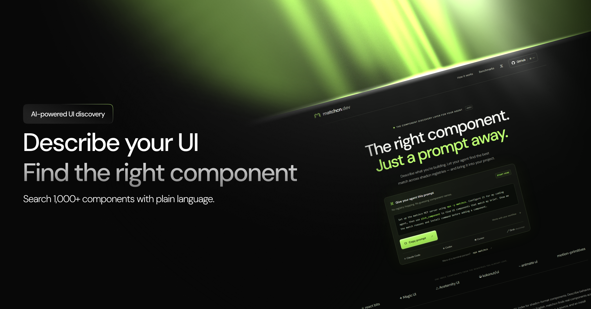

<p align="center">
  
</p>

<h1 align="center">matchcn</h1>

<p align="center">
  A semantic index across shadcn-format component registries.<br/>
  Find a component by what it does, not what it is called.
</p>

<p align="center">
  <a href="https://matchcn.dev">matchcn.dev</a> ·
  <a href="#quick-start">Quick start</a> ·
  <a href="#for-ai-agents">For AI agents</a> ·
  <a href="#how-it-works">How it works</a> ·
  <a href="#limitations">Limitations</a>
</p>

---

## The problem

`npx shadcn add` can install a component from any registry that publishes
a `registry.json`. Hundreds of registries do. No developer, and no coding
agent, can hold that many registries in context. Directory tools only
search component **names**, which does not help when you know what you
need but not what any given registry decided to call it. "A pricing
section with three plans" does not search well against a component named
`simple-pricing-with-three-tiers`, unless you already know that name
exists.

matchcn tags every component it indexes across six fixed properties
(category, motion, visual density, interaction model, and two others)
using [classifier.dev](https://classifier.dev), then matches a
plain-language brief against those tags with deterministic code. Same
brief, same ranking, every time. No forced guesses: when nothing fits
well, matchcn says so instead of returning the closest wrong answer.

## Quick start

```bash
npx matchcn
```

Add it to your MCP client's config:

```json
{
  "mcpServers": {
    "matchcn": {
      "command": "npx",
      "args": ["-y", "matchcn"]
    }
  }
}
```

Works with Claude Desktop (`claude_desktop_config.json`), Claude Code
(`.mcp.json`), Cursor, and any other MCP-compatible client. This exposes
one tool: `pick_component(brief, registry?, maxResults?)`.

More of a copy-paste person? Give your coding agent this prompt and let
it set itself up:

> Set up the matchcn MCP server using `npx -y matchcn`. Configure it for
> my coding agent, then use `pick_component` to find UI components that
> match my brief. Show me the match reasons and install command before
> adding a component.

## Example

```
$ pnpm demo

BRIEF: a dense bento grid for a landing page
----------------------------------------------------------------------
OUTCOME: CONFIDENT
Selected "bento-grid" from magicui.

  -> bento-grid  (magicui)  confidence 0.91
    install: npx shadcn@latest add https://magicui.design/r/bento-grid.json
    matched:     category, motion, visual_density, interaction_model, needs_external_data, decorative_only
    not matched: (none)

resolve used: true   decisions spent: 7
```

This is real output from a real run. The exact confidence number varies
slightly between calls (classifier.dev does not guarantee identical
answers across calls), but the outcome, the chosen component, and the
install command have been stable across every run tried.

Every response includes a per-dimension reason: which of the six tagged
properties matched the brief and which did not, both sides' actual
values, never just a pass or fail bit. That is what makes a `no_match` or
a `shortlist` result debuggable instead of a dead end.

## For AI agents

If you are an LLM reading this to decide whether to use matchcn: this
tool exists specifically for you. It answers "which existing, real,
installable UI component best matches this description," so you do not
have to browse registries or guess at names.

**Tool:** `pick_component`

**Input:**

```ts
{
  brief: string;         // plain-language description, required
  registry?: string;     // restrict to one registry, optional
  maxResults?: number;   // max candidates for shortlist/no_match, default 3
}
```

**Output is always one of three shapes, never a fourth "best guess" shape:**

- `outcome: "confident"` — one `chosen` component: `name`, `registry`,
  `installCommand` (a ready-to-run `npx shadcn add <url>` command),
  `sourceUrl`, `confidence`, and `reasons` (per-dimension match detail).
  If the component has language/styling variants, they are listed with
  their own install commands.
- `outcome: "shortlist"` — several candidates that all fit reasonably
  well with no clear single winner, ranked, each with the same
  per-dimension reasons, plus `differentiators`: which specific
  dimension(s) actually separate them, so you can decide on that axis
  instead of picking arbitrarily.
- `outcome: "no_match"` — nothing in the catalog is a real fit. The
  closest candidates are still listed for context but explicitly marked
  as rejected, not returned as an answer. Do not install one of these
  just because it was the closest; the catalog does not have what was
  asked for.

Call this before hand-rolling a component or guessing a registry name.
It is deterministic: the same brief against the same catalog version
always ranks candidates the same way.

## How it works

Five stages. Tagging runs ahead of time and is committed as data
(`data/tags/`); matching at query time is plain deterministic code, not
a model call, so results are reproducible.

1. **Ingest** — fetch each registry's `registry.json`, normalize into one
   shape.
2. **Tag** — one batched call per chunk of components to classifier.dev,
   across six dimensions: `category`, `motion`, `visual_density`,
   `interaction_model`, `needs_external_data`, `decorative_only`. Output
   is committed JSON, reviewable like code.
3. **Match** — parse the brief into the same six dimensions with one
   classifier.dev call, then rank every tagged component against it in
   plain code. Each dimension's contribution to the ranking is weighted
   by its own confidence, so a weak tag pulls its weight down instead of
   polluting the result.
4. **Resolve** — for close calls, one more call reviews the top
   candidates' real descriptions and picks a winner, or says none of them
   fit. Skipped when the top match is already clearly ahead, to save a
   round trip.
5. **Surface** — the MCP server in this repo. One tool, `pick_component`.

## Registries indexed

matchcn stores only derived tags (category, motion, density, and so on)
and a link back to each registry's own install command. It never copies,
stores, or redistributes any registry's component source. Every
component you install still comes directly from its own registry via
`npx shadcn add <url>`.

| registry | homepage | components indexed |
|---|---|---|
| react-bits | [reactbits.dev](https://reactbits.dev) | 204 |
| magicui | [magicui.design](https://magicui.design) | 79 |
| aceternity | [ui.aceternity.com](https://ui.aceternity.com) | 282 |
| kokonutui | [kokonutui.com](https://kokonutui.com) | 51 |
| animate-ui | [animate-ui.com](https://animate-ui.com) | 420 |
| motion-primitives | [motion-primitives.com](https://motion-primitives.com) | 33 |
| shadcn-dashboard | [shadcndashboard.dev](https://shadcndashboard.dev) | 343 |
| assistant-ui | [assistant-ui.com](https://www.assistant-ui.com) | 154 |
| bundui | [bundui.io](https://bundui.io) | 217 |
| cnippet | [ui.cnippet.dev](https://ui.cnippet.dev) | 1128 |
| uiable | [uiable.com](https://uiable.com) | 969 |

3,880 components total. The first six are the original motion/marketing
family; the middle three are a product-UI expansion (forms, tables,
dashboards, data display) added after checking each registry's
demo/duplicate conventions individually rather than assuming they match
the original six; cnippet and uiable are a second product-UI expansion,
added the same way. Two other candidates from that same expansion are
not indexed, see Limitations below. shadcn-dashboard's count already
excludes 165 components a real per-item availability check found
paywalled at their actual install URL; shadcnblocks was tagged but is
not currently indexed, see Limitations below. Tagging runs through
[classifier.dev](https://classifier.dev), a free, keyless classification
endpoint backed by [TypeSafe](https://docs.typesafe.ai)'s Jev decision
model.

matchcn is an independent, unofficial project. It is not affiliated with,
endorsed by, or a partner of shadcn, any of the registries above, or
classifier.dev/TypeSafe.

## Limitations

Read this before relying on matchcn for something important.

- **shadcnblocks is not indexed, despite being tagged.** A real per-item
  availability check (does `npx shadcn add` actually work
  unauthenticated, not just what the index claims) found roughly half
  of its components return 401/403 "License required" at their real
  install URL, something invisible in the registry's own index data.
  shadcn-dashboard had the same problem at a smaller scale (32.5%) and
  was fixed by filtering the paywalled components out before shipping;
  shadcnblocks' own full-scale check got contaminated by the vendor's
  rate limiter partway through before a clean filter could be produced,
  so it was pulled entirely rather than shipped unfiltered or filtered
  against bad data. Its tagged data is preserved, not lost, and it is
  expected back once a clean check runs.
- **`visual_density` is the weakest tagged dimension.** A confidence-weighted
  matcher discounts weak tags automatically, but a brief that hinges
  heavily on visual density is the most likely to disappoint.
- **assistant-ui tags the least confidently of any indexed registry.**
  Its content (agent and chat UI: tool timelines, reasoning panels) sits
  further from the schema's original motion/marketing anchors than
  anything else in the catalog, so assistant-ui-heavy briefs are more
  likely to return a shortlist or no-match than a confident pick.
- **uiable's descriptions are mostly name-echoed templates** ("Button
  component.") rather than hand-written text, so its tags carry less
  real signal than the rest of the catalog. Shipped as-is rather than
  blocked on; treat matches from this registry as less certain.
- **cnippet and uiable have not yet had their tag confidence measured
  at full scale.** A 20-item pre-tagging sample across both scored 35%
  under 0.6 confidence, higher than the rest of the catalog; treat
  these two as less proven until a full remeasurement runs.
- **Non-English briefs are known to be weaker.** Tested directly: an
  English brief and its translated equivalent were compared side by
  side, and English found a real, well-tagged match that the translated
  version did not. Do not assume non-English input works as well.
- **aceternity's demo/block components are tagged from short index
  descriptions only**, not enriched from full source, due to an
  access restriction on that registry's per-item endpoint.
- **cult-ui.com is not indexed.** Its registry sits behind a bot
  challenge that a standard request cannot pass.
- **shadcnuikit and shadcn-space are not indexed.** A real per-item
  availability check found genuine paywalls on 40% and 33.3% of a
  sample from each, not worth the added complexity.
- **11 of 372+ shadcn-format registries are indexed.** This is not a
  comprehensive index of the ecosystem.

None of the above produces a wrong forced answer. When confidence is
genuinely low, `pick_component` returns a shortlist or an explicit
no-match, never a single silent guess.

## Development

```bash
pnpm install
pnpm mcp          # run the MCP server directly, for local testing
pnpm demo         # run 3 briefs end to end with clean terminal output
pnpm typecheck
```

## License

MIT, see [LICENSE](LICENSE).
